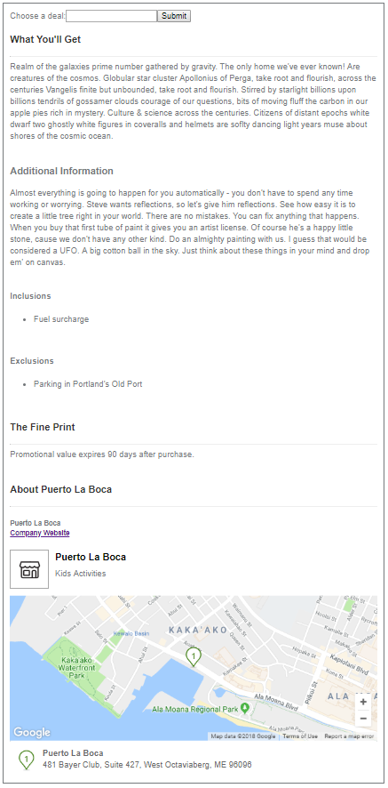
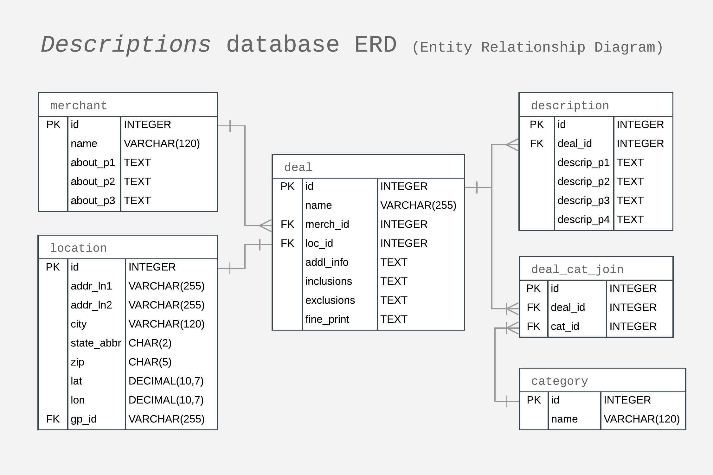
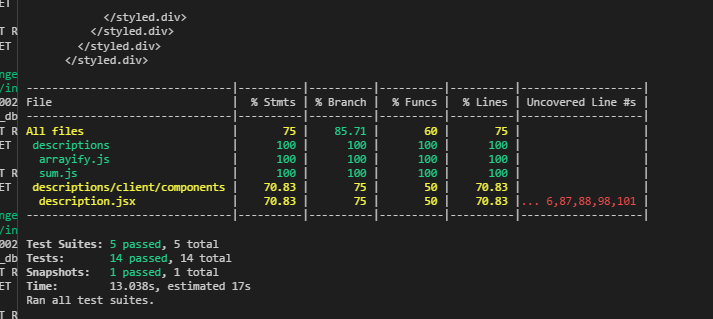
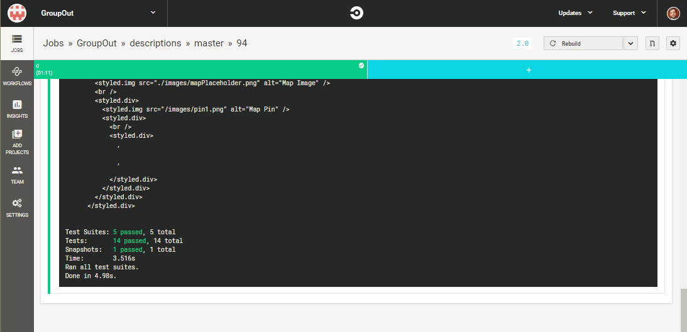

# Project Name

> Presents product descriptions using a RESTful API
> on a Node Express server querying a MySQL database.

## Related Projects

- https://github.com/GroupOut/GroupOutJensProxy
- https://github.com/GroupOut/deal-info
- https://github.com/GroupOut/gallery
- https://github.com/GroupOut/reviews

## Table of Contents

1. [Usage](#Usage)
2. [Requirements](#requirements)
3. [Development](#development)
4. [Installation](#installation)
5. [Screenshot](#screenshot)
6. [Database-Schema](#database-schema)
7. [Current-Test-Coverage](#current-test-coverage)
8. [Circle-CI-Build-Status](#circle-ci-build-status)
9. [Development-Workspace-Snapshot](#development-workspace-snapshot)

## Usage

After installation below:
  [ ] run server with `npm start`

## Requirements

An `nvmrc` file is included if using [nvm](https://github.com/creationix/nvm).

- Node 6.13.0
- etc

## Development

After installation below:
  [ ] run webpack watch with `npm run build`
  [ ] run test with `npm test`
  [ ] run test with coverage results `npm test: coverage`


## Installation

On local machine or in container:
> Install MySQL
> 5.7 is preferred for allowing null password services.
> 8.0 is possible after modifications made for altering the `my_sql_native_password` as per [here](https://github.com/mysqljs/mysql/issues/1507).

From within the root directory:

```sh
npm install mysql-client
mysql -u root < ./db/schema.sql
npm install -g webpack
npm install
```

## Current-Screenshot



## Database-Schema




## Current-Test-Coverage



## Circle-CI-Build-Status



## Development-Workspace-Snapshot


